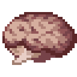
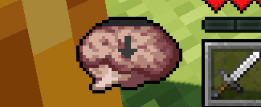
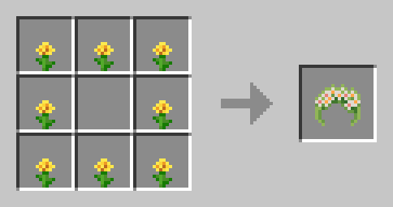

# Sanity: Descent Into Madness

A Minecraft mod that brings the sanity mechanic from [Don't Starve](https://store.steampowered.com/app/219740/Dont_Starve/) into Minecraft.

## Requirements

<a aria-label="Minecraft Forge" href="https://files.minecraftforge.net/net/minecraftforge/forge/index_1.19.4.html">

</a>
<a aria-label="GeckoLib" href="https://modrinth.com/mod/geckolib">

</a>

## Description

This mod adds a new vital for you to manage - sanity, your mental health scale.
Failing to keep your sanity at high levels may have drastic consequences on your survival,
including fatal outcome.
<br/><br/>
As your sanity drops, you start hearing and seeing things, your vision becomes muddy and blurry,
as well as your mind cloudy, until eventually you start getting attacked by the creations of your own mind, inner entities.



There are multiple ways to restore your sanity, as well as multiple ways to lose it.
<br/>
The first thing you might want to do, however, is to craft a garland from any small flowers you encounter on your journey.
This nice little accessory should help you stay sane for a bit longer. Be wary, though, that water makes it wither away much faster!



## Details

For details on all implemented sanity sources, see [configuration file](config.toml).<br/>
The mod also supports dimension-specific configuration in ```config/sanitydim/dimension/dimension_id.toml```.<br/>
You're free to include this mod in your modpacks.

## Credits

croissantnova - programmer and artist,<br/>
[toujourspareil](https://twitter.com/toujourspareil_) - artist.
<br/><br/>
Sound effects provided by [Zapsplat](https://www.zapsplat.com/)

## License
See [license](https://raw.githubusercontent.com/croissantnova/SanityDescentIntoMadness/main/LICENSE).